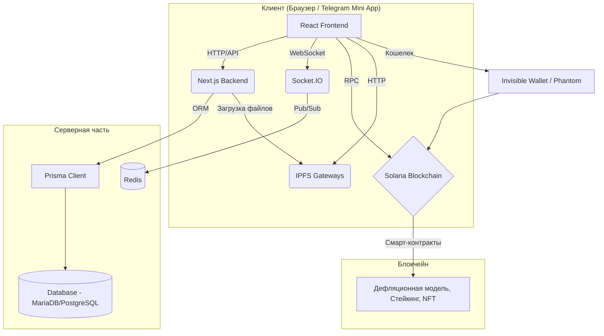

# Отчет по анализу архитектуры проекта NORMALDANCE

## 1. Введение

Этот отчет представляет собой анализ текущей архитектуры проекта NORMALDANCE. Анализ основан на изучении предоставленных документов (`AGENTS.md`, `TECHNICAL_DEBT_REPORT.md`) и исходного кода ключевых компонентов системы.

## 2. Обзор архитектуры

Система представляет собой Web3-приложение, построенное на стеке Next.js, TypeScript, Solana и IPFS.

### Схема взаимодействия компонентов

### Ключевые компоненты:

- **Кастомный сервер (`server.ts`):** Node.js сервер, запускающий Next.js и обслуживающий WebSocket-соединения через Socket.IO.
- **Адаптер кошелька (`src/components/wallet/wallet-adapter.tsx`):** Универсальный адаптер, поддерживающий как стандартные кошельки (Phantom), так и встроенный "Invisible Wallet" для Telegram Mini Apps. Включает сложную логику для оффлайн-режима и кэширования.
- **Дефляционная модель (`src/lib/deflationary-model.ts`):** Клиентская реализация логики сжигания токенов NDT.
- **База данных (`src/lib/db.ts`):** Использует Prisma ORM для работы с реляционной базой данных (предположительно MariaDB или PostgreSQL).
- **IPFS (`src/lib/ipfs-enhanced.ts`):** Система хранения файлов с репликацией по нескольким шлюзам и поддержкой чанкинга для больших файлов.

## 3. Архитектурные проблемы и риски

### Критические риски (Требуют немедленного вмешательства)

1.  **Неработоспособная дефляционная модель:**

    - **Проблема:** Вся логика сжигания токенов находится в клиентском файле [`src/lib/deflationary-model.ts`](src/lib/deflationary-model.ts:1) и содержит заглушки вместо вызовов смарт-контрактов. **Это означает, что ключевая токеномика проекта не функционирует.**
    - **Риск:** Прямые финансовые и репутационные потери. Система не выполняет заявленных функций.

2.  **Конфликт слияния в коде:**

    - **Проблема:** Файл [`src/lib/ipfs-enhanced.ts`](src/lib/ipfs-enhanced.ts:1) содержит неразрешенный git-конфликт.
    - **Риск:** Код неработоспособен. Это указывает на серьезные проблемы с процессами разработки и контроля версий.

3.  **Ослабленная типобезопасность:**
    - **Проблема:** Повсеместное использование `any` и отключение строгих правил TypeScript/ESLint.
    - **Риск:** Высокая вероятность ошибок во время выполнения, сложность рефакторинга и поддержки, особенно в критичных для безопасности частях, как работа с кошельком.

### Серьезные архитектурные проблемы

4.  **Монолитный компонент кошелька:**

    - **Проблема:** Файл [`src/components/wallet/wallet-adapter.tsx`](src/components/wallet/wallet-adapter.tsx:1) (560+ строк) является "божественным объектом", нарушающим принцип единственной ответственности.
    - **Риск:** Сложность тестирования, поддержки и развития. Высокий риск внесения ошибок при изменениях.

5.  **Ненадежный кастомный сервер:**
    - **Проблема:** Использование нестандартного сервера ([`server.ts`](server.ts:1)) усложняет развертывание. Обработка ошибок подключения к Redis для Socket.IO скрыта, что может маскировать проблемы с масштабируемостью.
    - **Риск:** Проблемы со стабильностью и масштабируемостью real-time функций.

## 4. Рекомендации

1.  **Немедленно исправить критические риски:**

    - **Дефляционная модель:** Перенести всю логику транзакций, сжигания и распределения в смарт-контракты на Solana. Клиентский код должен только вызывать эти контракты.
    - **Конфликт слияния:** Разрешить конфликт в [`src/lib/ipfs-enhanced.ts`](src/lib/ipfs-enhanced.ts:1) и внедрить более строгие правила работы с Git (например, через Pull Requests и обязательные ревью).
    - **Типобезопасность:** Включить строгие правила ESLint/TypeScript и поэтапно устранить использование `any`, начав с критических модулей.

2.  **Провести рефакторинг:**

    - **`wallet-adapter.tsx`:** Разделить монолит на более мелкие, переиспользуемые хуки и сервисы (например, `useWalletConnection`, `useOfflineQueue`, `useCacheManager`).
    - **Кастомный сервер:** Рассмотреть возможность перехода на стандартный запуск Next.js, если это возможно, либо улучшить обработку ошибок и мониторинг кастомного сервера.

3.  **Прояснить статус реализации:**
    - **Шардинг:** Провести аудит реализации шардинга БД, чтобы убедиться в ее корректности и готовности к нагрузкам.
