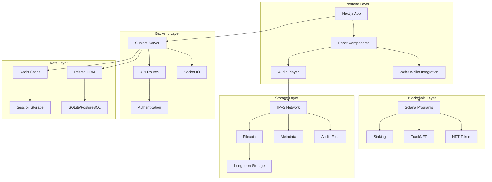

# 🎵 NORMALDANCE - Enterprise Web3 Music Platform

<div align="center">


[](https://opensource.org/licenses/MIT)
[](https://www.typescriptlang.org/)
[](https://nextjs.org/)
[](https://solana.com/)
[](https://ipfs.io/)

**The Future of Music is Decentralized**

[🚀 Live Demo](https://normaldance.com) • [📚 Documentation](https://docs.normaldance.com) • [💬 Discord](https://discord.gg/normaldance) • [🐦 Twitter](https://twitter.com/normaldance)

</div>

---

## 🌟 Overview

NORMALDANCE is a revolutionary Web3 music platform that empowers artists and listeners through blockchain technology, decentralized storage, and innovative monetization models. Built with enterprise-grade security, performance, and scalability in mind.

### 🎯 Key Features

- 🎵 **Decentralized Music Streaming** - IPFS-powered audio delivery
- 💰 **Web3 Monetization** - Solana-based payments and NFTs
- 🎨 **Artist Empowerment** - Direct-to-fan monetization
- 🔒 **Enterprise Security** - Multi-layer security architecture
- ⚡ **High Performance** - Optimized for scale and speed
- 🌐 **Cross-Platform** - Web, mobile, and desktop support

---

## 🏗️ Architecture



---

## 🚀 Quick Start

### Prerequisites

- Node.js 18.x or higher
- pnpm 8.x or higher
- Git

### Installation

```bash
# Clone the repository
git clone https://github.com/normaldance/NORMALDANCE-Enterprise.git
cd NORMALDANCE-Enterprise

# Install dependencies
pnpm install

# Setup environment variables
cp env.example .env.local
# Edit .env.local with your configuration

# Setup database
pnpm db:setup

# Start development server
pnpm dev
```

Visit [http://localhost:3000](http://localhost:3000) to see the application.

---

## 📁 Project Structure

```
NORMALDANCE-Enterprise/
├── 📁 .github/              # GitHub Actions & Templates
├── 📁 .vscode/              # VS Code Configuration
├── 📁 docs/                 # Comprehensive Documentation
├── 📁 src/                  # Source Code
│   ├── 📁 app/              # Next.js App Router
│   ├── 📁 components/       # React Components
│   ├── 📁 lib/              # Utility Libraries
│   ├── 📁 middleware/       # Middleware Functions
│   └── 📁 hooks/            # Custom React Hooks
├── 📁 tests/                # Test Suite
├── 📁 infrastructure/       # Infrastructure as Code
└── 📁 tools/                # Development Tools
```

---

## 🛠️ Development

### Available Scripts

```bash
# Development
pnpm dev              # Start development server
pnpm build            # Build for production
pnpm start            # Start production server

# Testing
pnpm test             # Run all tests
pnpm test:unit        # Run unit tests
pnpm test:integration # Run integration tests
pnpm test:e2e         # Run end-to-end tests

# Code Quality
pnpm lint             # Run ESLint
pnpm format           # Format code with Prettier
pnpm type-check       # Run TypeScript checks

# Database
pnpm db:setup         # Setup database
pnpm db:migrate       # Run migrations
pnpm db:seed          # Seed database

# Security
pnpm security:audit   # Run security audit
pnpm security:scan    # Run security scan
```

### Development Workflow

1. **Fork & Clone** the repository
2. **Create a branch** for your feature: `git checkout -b feature/amazing-feature`
3. **Make changes** and ensure tests pass
4. **Commit** your changes: `git commit -m 'Add amazing feature'`
5. **Push** to your branch: `git push origin feature/amazing-feature`
6. **Open a Pull Request**

---

## 🧪 Testing

We maintain high test coverage with multiple testing strategies:

- **Unit Tests** - Individual component and function testing
- **Integration Tests** - API and database integration testing
- **E2E Tests** - Full user journey testing
- **Performance Tests** - Load and stress testing
- **Security Tests** - Vulnerability and penetration testing

```bash
# Run all tests
pnpm test

# Run with coverage
pnpm test:coverage

# Run specific test suite
pnpm test:unit
pnpm test:integration
pnpm test:e2e
```

---

## 🔒 Security

Security is our top priority. We implement multiple layers of protection:

- **Input Validation** - Comprehensive sanitization and validation
- **Authentication** - Multi-factor authentication support
- **Authorization** - Role-based access control
- **Encryption** - End-to-end encryption for sensitive data
- **Monitoring** - Real-time security monitoring
- **Auditing** - Regular security audits and penetration testing

### Security Features

- 🛡️ XSS Protection
- 🔒 SQL Injection Prevention
- 🚫 CSRF Protection
- 🔐 Rate Limiting
- 📊 Security Headers
- 🔍 Vulnerability Scanning

---

## 📊 Performance

We optimize for performance at every level:

- **Bundle Optimization** - Tree shaking and code splitting
- **Image Optimization** - Next.js Image component with WebP/AVIF
- **Caching** - Multi-layer caching strategy
- **CDN** - Global content delivery network
- **Database** - Optimized queries and indexing
- **Monitoring** - Real-time performance monitoring

### Performance Metrics

- **Lighthouse Score**: 95+
- **First Contentful Paint**: <1.5s
- **Largest Contentful Paint**: <2.5s
- **Cumulative Layout Shift**: <0.1
- **Time to Interactive**: <3.5s

---

## 🚀 Deployment

### Production Deployment

```bash
# Build for production
pnpm build

# Run production server
pnpm start
```

### Docker Deployment

```bash
# Build Docker image
docker build -t normaldance .

# Run container
docker run -p 3000:3000 normaldance
```

### Kubernetes Deployment

```bash
# Apply Kubernetes manifests
kubectl apply -f infrastructure/kubernetes/
```

---

## 📚 Documentation

Comprehensive documentation is available in the `/docs` directory:

- [🏗️ Architecture Overview](docs/architecture/system-overview.md)
- [🔌 API Reference](docs/api/api-reference.md)
- [🚀 Deployment Guide](docs/deployment/production-setup.md)
- [🛠️ Development Guide](docs/development/setup-guide.md)
- [🔒 Security Policy](docs/security/security-policy.md)
- [👤 User Guide](docs/user-guides/user-manual.md)

---

## 🤝 Contributing

We welcome contributions! Please see our [Contributing Guide](CONTRIBUTING.md) for details.

### Development Setup

1. Read our [Code of Conduct](CODE_OF_CONDUCT.md)
2. Check our [Contributing Guidelines](CONTRIBUTING.md)
3. Fork the repository
4. Create a feature branch
5. Make your changes
6. Add tests
7. Submit a pull request

---

## 📄 License

This project is licensed under the MIT License - see the [LICENSE](LICENSE) file for details.

---

## 🆘 Support

- 📧 **Email**: support@normaldance.com
- 💬 **Discord**: [Join our community](https://discord.gg/normaldance)
- 🐦 **Twitter**: [@normaldance](https://twitter.com/normaldance)
- 📚 **Documentation**: [docs.normaldance.com](https://docs.normaldance.com)

---

## 🏆 Acknowledgments

- Solana Foundation for blockchain infrastructure
- IPFS community for decentralized storage
- Next.js team for the amazing framework
- All our contributors and supporters

---

<div align="center">

**Made with ❤️ by the NORMALDANCE Team**

[Website](https://normaldance.com) • [Documentation](https://docs.normaldance.com) • [Community](https://discord.gg/normaldance)

</div>
