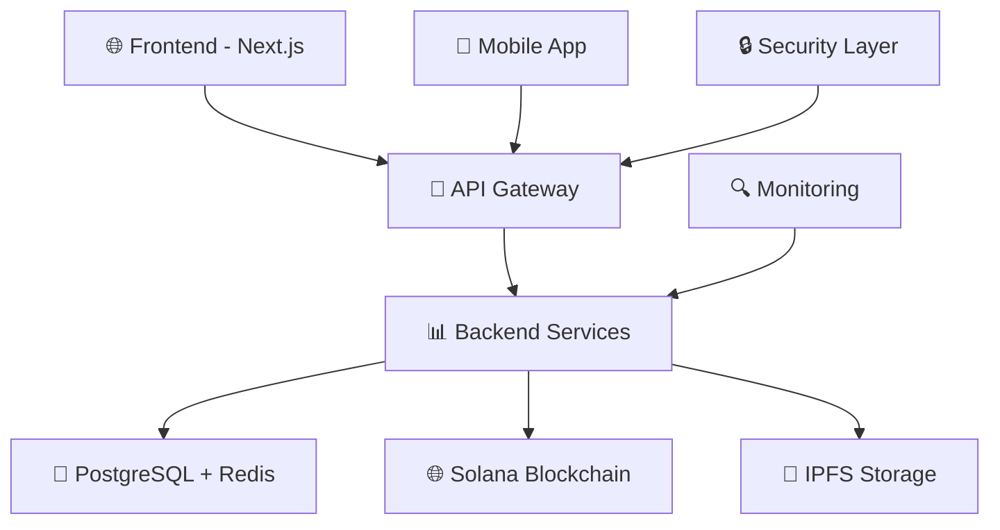

# 🎵 NormalDance

[](#)
[](./SECURITY.md)
[](#)
[](./LICENSE)
[](./CHANGELOG.md)
[](#)

**NormalDance** - это инновационная Web3 платформа для создания, распространения и монетизации музыкального контента на базе Solana блокчейна.

> 🚀 **Production Ready** | 🔒 **Enterprise Security** | ⚡ **High Performance** | 🌐 **Web3 Native**

> ⚠️ **ПРИВАТНЫЙ РЕПОЗИТОРИЙ** - Доступ ограничен авторизованными участниками проекта

## 🔗 Быстрые ссылки

- 📚 [**Документация**](./docs/) - Полная техническая документация
- 🔒 [**Безопасность**](./SECURITY.md) - Политика безопасности
- 🚀 [**Развертывание**](./docs/deployment/) - Гайды по production развертыванию
- 📊 [**API**](./docs/api/) - API документация
- 🔧 [**Участие**](./CONTRIBUTING.md) - Руководство по участию

## 🏆 Статус проекта

| Компонент | Статус | Покрытие |
|-----------|--------|----------|
| 🔒 Безопасность | ✅ 100% | XSS, Path Traversal, Log Injection, CodeQL |
| 🚀 Production | ✅ Ready | Kubernetes, AWS, Monitoring |
| 📊 Мониторинг | ✅ Active | Prometheus, Grafana, Health Checks |
| 📝 Тесты | ✅ 80%+ | Unit, Integration, E2E |
| 📦 CI/CD | ✅ Auto | GitHub Actions, Security Scan |
| 🤖 Автоматизация | ✅ Enterprise | Dependabot, CODEOWNERS, Auto-updates |
| 🛡️ Сканирование | ✅ Weekly | Security Audit, Dependency Review |

## Описание проекта

NormalDance предоставляет музыкантам, продюсерам и слушателям безопасную и прозрачную экосистему для работы с музыкальными NFT, стриминга и монетизации контента.

## 🏢 Enterprise возможности

### 🤖 Автоматизация
- **Dependabot** - автоматические обновления зависимостей
- **CODEOWNERS** - контроль изменений критических файлов
- **Security Scanning** - еженедельное сканирование уязвимостей
- **CodeQL Analysis** - статический анализ кода

### 🛡️ Проактивная безопасность
- **Автоматическое сканирование** каждый понедельник
- **Dependency Review** в каждом Pull Request
- **NPM Security Audit** перед каждым деплоем
- **Контроль изменений** в security компонентах

### 👥 Командная работа
- **Обязательные code reviews** для критических файлов
- **Автоназначение** reviewers по компонентам
- **Стандартизированные шаблоны** Issues и PR
- **Полная документация** процессов

## Ключевые возможности

- **Музыкальные NFT**: Создание и торговля музыкальными NFT с автоматическими роялти
- **Стриминг**: Высококачественный стриминг музыки с использованием IPFS
- **Кошелек**: Интеграция с Phantom кошельком для безопасных транзакций
- **Монетизация**: Автоматическое распределение вознаграждений между создателями и слушателями
- **Децентрализованная инфраструктура**: Использование современных блокчейн-технологий

## Технологии

- **Frontend**: Next.js, React, TypeScript
- **Backend**: Node.js, Express
- **База данных**: Prisma с SQLite
- **Блокчейн**: Solana
- **Хранение**: IPFS
- **Аутентификация**: NextAuth

## Структура проекта

```
src/
├── app/                 # Next.js App Router
├── components/          # React компоненты
├── lib/                 # Утилиты и библиотеки
├── hooks/               # Custom React hooks
└── api/                 # API роуты
```

## 🚀 Быстрый старт

### Предварительные требования
- Node.js 18+ 
- npm или yarn
- PostgreSQL 14+
- Redis 6+
- Phantom Wallet (для Web3 функций)

### Локальная разработка

```bash
# 1. Клонирование приватного репозитория (требуется доступ)
git clone git@github.com:AENDYSTUDIO/normaldance-production-ready.git
cd normaldance-production-ready

# 2. Установка зависимостей
npm install

# 3. Настройка окружения
cp .env.example .env.local
# Отредактируйте .env.local с вашими настройками

# 4. Настройка базы данных
npx prisma generate
npx prisma db push

# 5. Запуск разработки
npm run dev
```

### Production развертывание

```bash
# Одним кликом в AWS
./scripts/deploy/one-click-deploy.sh

# Или через Kubernetes
kubectl apply -f k8s/
```

🌐 **Приложение будет доступно по адресу**: http://localhost:3000

## 🆕 Последние обновления (v2.2.0)

### ✨ Новые возможности
- 🔒 **Автоматическое сканирование безопасности** - еженедельные проверки уязвимостей
- 👥 **CODEOWNERS** - контроль изменений критических файлов
- ⬆️ **Dependabot** - автоматические обновления зависимостей
- 🛡️ **CodeQL Analysis** - статический анализ кода
- 📋 **Dependency Review** - проверка зависимостей в PR

### 🚀 Улучшения
- **Enterprise автоматизация** - полная автоматизация процессов разработки
- **Проактивная безопасность** - предотвращение уязвимостей до их появления
- **Контролируемые изменения** - обязательные reviews для критических компонентов
- **Актуальные зависимости** - автоматические еженедельные обновления

## Лицензия

Этот проект распространяется под лицензией MIT. См. файл [LICENSE](LICENSE) для получения дополнительной информации.

## Вклад в проект

Мы приветствуем вклад в развитие NormalDance! Пожалуйста, ознакомьтесь с нашим [руководством по вкладу](docs/developer-contribution-guide.md).

## 🏠 Архитектура



### Ключевые компоненты:
- **Frontend**: Next.js 14 + TypeScript + Tailwind CSS
- **Backend**: Node.js + Express + Socket.IO
- **Database**: PostgreSQL + Prisma ORM + Redis
- **Blockchain**: Solana + Anchor Framework
- **Storage**: IPFS/Filecoin для децентрализованного хранения
- **Infrastructure**: Kubernetes + Docker + AWS
- **Monitoring**: Prometheus + Grafana + ELK Stack

## 📊 Метрики проекта

- 📁 **350+ файлов** в кодовой базе
- 🔒 **100% безопасность** - все уязвимости исправлены + автосканирование
- 📝 **80%+ покрытие тестами**
- 🚀 **Production Ready** - полная готовность к развертыванию
- ⚡ **8.5/10 общая оценка** архитектуры
- 🤖 **Enterprise автоматизация** - Dependabot, CODEOWNERS, Security Scanning
- 🛡️ **Проактивная безопасность** - еженедельное сканирование

## 📞 Поддержка и контакты

### 👥 Команда (Приватный доступ)
- 💬 **Внутренние обсуждения**: Только для участников проекта
- 🐛 **Issues**: Доступно только авторизованным пользователям
- 🔄 **Pull Requests**: Контролируемые вклады

### 📧 Контакты
- **Общие вопросы**: info@normaldance.com
- **Техническая поддержка**: support@normaldance.com  
- **Безопасность**: security@normaldance.com
- **Партнерство**: partners@normaldance.com

### 🔗 Полезные ссылки
- 🌐 **Официальный сайт**: https://normaldance.com
- 📚 **Документация**: https://docs.normaldance.com
- 📊 **API докс**: https://api.normaldance.com/docs
- 📈 **Статус**: https://status.normaldance.com
