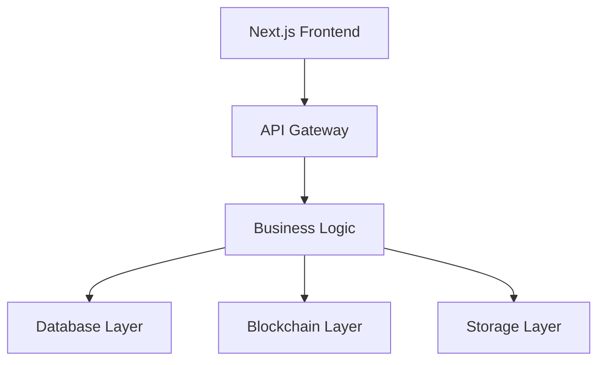

# NORMALDANCE Architecture

## System Overview

## Core Components

### 1. Authentication System
- **Location**: `src/lib/auth.ts`
- **Purpose**: Multi-provider authentication
- **Providers**: Web3, OAuth, Telegram

### 2. Audio System
- **Location**: `src/components/audio/`
- **Features**: Streaming, visualization, playlists
- **Optimization**: Mobile-first, adaptive quality

### 3. Wallet System
- **Location**: `src/components/wallet/`
- **Innovation**: Invisible Wallet for Telegram
- **Security**: Biometric auth, offline transactions

### 4. Blockchain Integration
- **Primary**: Solana with Anchor programs
- **Secondary**: TON blockchain
- **Features**: NFTs, payments, staking

## Data Flow

1. User authentication via Web3/OAuth
2. Audio streaming through IPFS
3. Payments via Solana/TON
4. Real-time updates via Socket.IO

## Security Architecture

- Input sanitization at all entry points
- Secrets management via environment variables
- Rate limiting and CSRF protection
- Comprehensive logging and monitoring