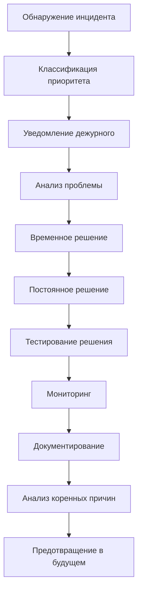
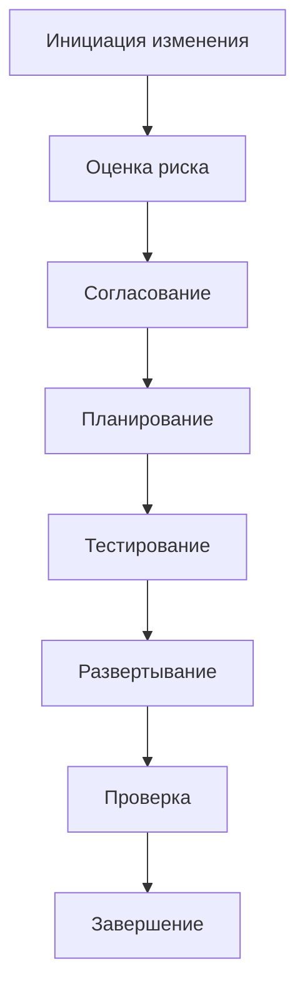

# 🛠️ План технической поддержки и обслуживания NORMAL DANCE v1.0.1

## 📋 Общая информация

Этот документ описывает план технической поддержки и обслуживания для платформы NORMAL DANCE v1.0.1, включая уровни обслуживания (SLA), процессы поддержки и процедуры обслуживания.

### 🎯 Цели поддержки
- Обеспечение максимальной доступности платформы
- Минимизация времени простоя
- Предоставление качественной технической поддержки
- Прогнозирование и предотвращение проблем
- Постоянное улучшение качества сервиса

### 📊 Метрики успеха
- **Доступность платформы**: 99.9%
- **Время отклика API**: < 200ms
- **Время решения инцидентов**: < 30 минут для критических проблем
- **Удовлетворенность пользователей**: > 90%

## 🎯 Уровни обслуживания (SLA)

### 1. Доступность платформы

| Уровень доступности | Гарантия | Компенсация |
|-------------------|----------|-------------|
| 99.9% - 99.99% | 99.9% | 10% от месячной платы |
| 99.0% - 99.9% | 99.0% | 25% от месячной платы |
| < 99.0% | Нет гарантии | 50% от месячной платы |

**Расчет времени простоя:**
- 99.9% = 43.2 минуты в месяц
- 99.0% = 7.2 часа в месяц
- 99.99% = 4.32 минуты в месяц

### 2. Время отклика API

| Тип запроса | Гарантированное время отклика | Пиковая нагрузка |
|-------------|-------------------------------|------------------|
| GET запросы | < 100ms | < 500ms |
| POST запросы | < 200ms | < 1000ms |
| WebSocket | < 50ms | < 200ms |
| Файловые операции | < 1000ms | < 5000ms |

### 3. Время обработки транзакций

| Тип транзакции | Гарантированное время | Пиковая нагрузка |
|----------------|----------------------|------------------|
| SOL транзакции | < 30 секунд | < 2 минуты |
| NFT minting | < 60 секунд | < 5 минут |
| Стейкинг | < 30 секунд | < 2 минуты |
| Вывод средств | < 5 минут | < 15 минут |

### 4. Время решения инцидентов

| Приоритет | Время обнаружения | Время решения | SLA |
|-----------|-------------------|---------------|-----|
| Критический (P1) | < 5 минут | < 30 минут | 99.9% |
| Высокий (P2) | < 15 минут | < 2 часа | 99.5% |
| Средний (P3) | < 1 час | < 8 часов | 98.0% |
| Низкий (P4) | < 4 часов | < 24 часа | 95.0% |

## 👥 Команда поддержки

### Роли и обязанности

#### 1. DevOps инженеры
- **Ответственность:** Обеспечение работы инфраструктуры
- **Круглосуточно:** Да
- **Контакты:** devops@normaldance.com
- **Инструменты:** Kubernetes, Docker, Prometheus, Grafana

#### 2. Backend разработчики
- **Ответственность:** Разработка и поддержка API
- **График:** 24/7 дежурство
- **Контакты:** backend@normaldance.com
- **Инструменты:** Node.js, TypeScript, Prisma, Solana

#### 3. Frontend разработчики
- **Ответственность:** Поддержка веб-интерфейса
- **График:** Рабочие дни 9:00-18:00
- **Контакты:** frontend@normaldance.com
- **Инструменты:** Next.js, React, TypeScript

#### 4. Mobile разработчики
- **Ответственность:** Поддержка мобильного приложения
- **График:** Рабочие дни 9:00-18:00
- **Контакты:** mobile@normaldance.com
- **Инструменты:** React Native, Expo

#### 5. QA инженеры
- **Ответственность:** Тестирование и контроль качества
- **График:** Рабочие дни 9:00-18:00
- **Контакты:** andykachess@normaldance.com
- **Инструменты:** Jest, Cypress, Postman

#### 6. Менеджер продукта
- **Ответственность:** Координация работ
- **График:** Рабочие дни 9:00-18:00
- **Контакты:** pm@normaldance.com

### Система дежурств

#### Дежурные инженеры
```yaml
День недели | DevOps | Backend | Frontend | Mobile
-----------|--------|---------|----------|--------
Понедельник | Иванов | Петров | Сидоров | Кузнецов
Вторник | Сидоров | Иванов | Петров | Смирнов
Среда | Петров | Смирнов | Иванов | Сидоров
Четверг | Смирнов | Сидоров | Кузнецов | Петров
Пятница | Кузнецов | Кузнецов | Смирнов | Иванов
Суббота | Иванов | Петров | Сидоров | Кузнецов
Воскресенье | Петров | Иванов | Кузнецов | Смирнов
```

#### Эскалация инцидентов
1. **Уровень 1:** Дежурный инженер
2. **Уровень 2:** Технический лид
3. **Уровень 3:** CTO
4. **Уровень 4:** CEO

## 🚨 Процессы поддержки

### 1. Управление инцидентами

#### Классификация инцидентов

| Приоритет | Описание | Примеры |
|-----------|----------|---------|
| **P1 - Критический** | Полная неработоспособность платформы | Сервер не отвечает, база данных недоступна |
| **P2 - Высокий** | Существенное снижение функциональности | API не отвечает, проблемы с платежами |
| **P3 - Средний** | Частичные проблемы с функциональностью | Ошибки в интерфейсе, проблемы с отображением |
| **P4 - Низкий** | Косметические проблемы или улучшения | Опечатки, улучшения UX |

#### Процесс обработки инцидента



#### Шаблон инцидента

```yaml
Инцидент ID: INC-2025-001
Дата: 2025-09-01 23:00 UTC
Приоритет: P1
Статус: Открыт
Описание: Платформа недоступна для пользователей
Обнаружено: Мониторинг Prometheus
Влияние: 100% пользователей
Дежурный: Иванов А.В.
```

### 2. Управление изменениями

#### Категории изменений

| Категория | Описание | Требует тестирования | Требует уведомления |
|-----------|----------|---------------------|-------------------|
| **Срочное** | Критические исправления | Да | Да |
| **Нормальное** | Регулярные обновления | Да | Да |
| **Стандартное** | Небольшие исправления | Нет | Нет |
| **Запрос** | Новые функции | Да | Да |

#### Процесс изменения



#### Шаблон изменения

```yaml
Изменение ID: CHG-2025-001
Тип: Обновление безопасности
Дата: 2025-09-02
Ответственный: Петров И.С.
Описание: Обновление зависимостей безопасности
Риск: Низкий
Тестирование: Автоматические тесты
Время развертывания: 02:00-04:00 UTC
```

### 3. Управление проблемами

#### Процесс управления проблемами

1. **Идентификация:** Обнаружение повторяющихся инцидентов
2. **Регистрация:** Создание записи о проблеме
3. **Анализ:** Исследование коренных причин
4. **Решение:** Разработка долгосрочного решения
5. **Реализация:** Внедрение решения
6. **Закрытие:** Фиксация решения

#### Шаблон проблемы

```yaml
Проблема ID: PRB-2025-001
Дата: 2025-09-01
Категория: Производительность
Описание: Периодические задержки при загрузке треков
Коренная причина: Проблемы с кешированием
Решение: Оптимизация Redis кеша
Статус: В процессе
```

## 📊 Мониторинг и оповещения

### Система мониторинга

#### Инструменты мониторинга
- **Prometheus** - Сбор метрик
- **Grafana** - Визуализация
- **Alertmanager** - Оповещения
- **Sentry** - Мониторинг ошибок
- **New Relic** - Прикладной мониторинг

#### Ключевые метрики

| Категория | Метрика | Целевое значение | Порог оповещения |
|-----------|---------|------------------|------------------|
| **Доступность** | Uptime | > 99.9% | < 99.5% |
| **Производительность** | Response Time | < 200ms | > 500ms |
| **Ресурсы** | CPU Usage | < 70% | > 80% |
| **Ресурсы** | Memory Usage | < 80% | > 90% |
| **База данных** | Query Time | < 100ms | > 500ms |
| **База данных** | Connection Pool | < 80% | > 90% |

#### Правила оповещения

```yaml
groups:
- name: normaldance-alerts
  rules:
  - alert: HighErrorRate
    expr: rate(http_requests_total{status=~"5.."}[5m]) > 0.1
    for: 5m
    labels:
      severity: critical
    annotations:
      summary: "High error rate detected"
      description: "Error rate is {{ $value }} errors per second"

  - alert: HighResponseTime
    expr: histogram_quantile(0.95, rate(http_request_duration_seconds_bucket[5m])) > 0.5
    for: 5m
    labels:
      severity: warning
    annotations:
      summary: "High response time detected"
      description: "95th percentile response time is {{ $value }} seconds"

  - alert: DatabaseConnectionHigh
    expr: pg_stat_database_numbackends / pg_settings_max_connections > 0.8
    for: 5m
    labels:
      severity: warning
    annotations:
      summary: "High database connections"
      description: "Database connections are at {{ $value }}% of maximum"
```

### Каналы оповещения

| Канал | Приоритет | Время реакции |
|-------|-----------|---------------|
| SMS | P1, P2 | < 5 минут |
| Email | P1, P2, P3 | < 15 минут |
| Slack | P1, P2, P3 | < 5 минут |
| Telegram | P1, P2 | < 5 минут |
| Phone | P1 | < 2 минуты |

## 🔄 Обслуживание и обновления

### Плановое обслуживание

#### Расписание обслуживания

| Тип обслуживания | Частота | Продолжительность | Окно времени |
|------------------|---------|-------------------|--------------|
| Еженедельное | Еженедельно | 2 часа | Суббота 02:00-04:00 UTC |
| Ежемесячное | Ежемесячно | 4 часа | Воскресенье 02:00-06:00 UTC |
| Квартальное | Квартально | 8 часов | Последняя суббота месяца 02:00-10:00 UTC |
| Годовое | Годовое | 16 часов | Август 02:00-18:00 UTC |

#### Процесс обслуживания

1. **Планирование:** За 1 неделю до обслуживания
2. **Уведомление:** За 3 дня до обслуживания
3. **Резервное копирование:** Перед обслуживанием
4. **Выполнение:** В назначенное время
5. **Проверка:** После обслуживания
6. **Восстановление:** При необходимости
7. **Документирование:** После обслуживания

### Обновления безопасности

#### Процесс обновления безопасности

1. **Обнаружение:** Автоматическое сканирование уязвимостей
2. **Оценка:** Оценка критичности уязвимости
3. **Разработка:** Разработка патча
4. **Тестирование:** Тестирование патча
5. **Развертывание:** Пошаговое развертывание
6. **Мониторинг:** Мониторинг после развертывания

#### Сроки обновления

| Критичность | Максимальный срок обновления |
|-------------|------------------------------|
| Критическая | 24 часа |
| Высокая | 72 часа |
| Средняя | 1 неделя |
| Низкая | 1 месяц |

## 📈 Анализ производительности

### Регулярные отчеты

#### Еженедельный отчет
- Доступность платформы
- Производительность API
- Количество инцидентов
- Время решения проблем
- Обновления и изменения

#### Ежемесячный отчет
- Анализ трендов
- Оценка SLA
- Финансовые показатели
- План улучшений
- Обратная связь от пользователей

#### Квартальный отчет
- Стратегическое планирование
- Инвестиции в инфраструктуру
- Развитие команды
- План развития продукта

### Метрики качества

#### Технические метрики
- **Mean Time To Recovery (MTTR):** < 30 минут
- **Mean Time Between Failures (MTBF):** > 30 дней
- **Change Failure Rate:** < 15%
- **Deployment Frequency:** Ежедневно
- **Lead Time for Changes:** < 1 час

#### Бизнес-метрики
- **Удовлетворенность пользователей:** > 90%
- **Retention rate:** > 80%
- **Churn rate:** < 5%
- **Net Promoter Score (NPS):** > 50

## 💰 Компенсации и гарантии

### Условия компенсации

1. **Доступность платформы:** Компенсация за время простоя
2. **Сроки решения инцидентов:** Штрафы за нарушение SLA
3. **Качество сервиса:** Бонусы за превышение SLA
4. **Обновления:** Компенсация за задержки обновлений

### Формула расчета компенсации

```
Компенсация = (Месячная плата / 720 часов) × Время простоя × Коэффициент приоритета
```

Коэффициенты приоритета:
- **P1:** 2.0
- **P2:** 1.5
- **P3:** 1.0
- **P4:** 0.5

### Процесс компенсации

1. **Обнаружение:** Автоматический мониторинг
2. **Регистрация:** Создание заявки на компенсацию
3. **Проверка:** Подтверждение факта простоя
4. **Расчет:** Расчет суммы компенсации
5. **Одобрение:** Утверждение руководством
6. **Выплата:** Выплата компенсации

## 📞 Контакты поддержки

### Техническая поддержка

| Канал | Ответственный | Время реакции |
|-------|---------------|---------------|
| Email | support@normaldance.com | < 4 часа |
| Тикеты | Zendesk | < 2 часа |
| Чат | Live Chat | < 5 минут |
| Телефон | +7 (495) 123-45-67 | < 1 час |

### Экстренные контакты

| Роль | Имя | Телефон | Email |
|------|-----|---------|-------|
| CTO | Иванов А.В. | +7 (916) 123-45-67 | cto@normaldance.com |
 DevOps | Петров И.С. | +7 (916) 234-56-78 | devops@normaldance.com |
 Backend | Сидоров П.В. | +7 (916) 345-67-89 | backend@normaldance.com |

### Документация

| Ресурс | Ссылка | Описание |
|--------|--------|----------|
| База знаний | https://docs.normaldance.com | Подробная документация |
| API документация | https://api.normaldance.com/docs | API справочник |
| Статус платформы | https://status.normaldance.com | Текущий статус |
| Чат поддержки | https://discord.gg/normaldance | Сообщество |

## 📋 Шаблоны и чек-листы

### Чек-лист развертывания

```yaml
Предварительные проверки:
- [ ] Резервное копирование базы данных
- [ ] Проверка свободного места на дисках
- [ ] Проверка доступности всех сервисов
- [ ] Уведомление пользователей
- [ ] Проверка конфигурации

Процесс развертывания:
- [ ] Остановка старых сервисов
- [ ] Развертывание новых сервисов
- [ ] Применение миграций
- [ ] Проверка работоспособности
- [ ] Мониторинг метрик
- [ ] Восстановление сервиса

Пост-развертывание:
- [ ] Проверка логов
- [ ] Тестирование функциональности
- [ ] Мониторинг производительности
- [ ] Документирование изменений
```

### Чек-лист инцидента

```yaml
Информация об инциденте:
- [ ] ID инцидента
- [ ] Дата и время
- [ ] Приоритет
- [ ] Описание
- [ ] Влияние на пользователей

Действия:
- [ ] Уведомление команды
- [ ] Анализ проблемы
- [ ] Временное решение
- [ ] Постоянное решение
- [ ] Тестирование решения
- [ ] Мониторинг

Документирование:
- [ ] Логи инцидента
- [ ] Причины инцидента
- [ ] Решение
- [ ] Уроки извлеченные
```

## 📚 Обучение и развитие

### Обучение команды

#### Обязательное обучение
- **Базовое обучение:** Введение в платформу
- **Техническое обучение:** Новые технологии и инструменты
- **Безопасность:** Обучение безопасности
- **SLA и процессы:** Процессы поддержки

#### Сертификация
- **AWS Certified Solutions Architect**
- **Kubernetes Certified Administrator**
- **Certified Kubernetes Security Specialist**
- **Prometheus Certified Associate**

### Развитие навыков

#### Технические навыки
- **DevOps:** Kubernetes, Docker, Terraform
- **Backend:** Node.js, TypeScript, Solana
- **Frontend:** React, Next.js, TypeScript
- **Базы данных:** PostgreSQL, Redis, MongoDB

#### Мягкие навыки
- **Коммуникация:** Эффективное общение
- **Лидерство:** Управление командой
- **Проблемное решение:** Анализ и решение проблем
- **Время:** Управление временем

## 📊 Аудит и улучшение

### Регулярный аудит

#### Ежеквартальный аудит
- **Аудит безопасности:** Проверка уязвимостей
- **Аудит производительности:** Оценка производительности
- **Аудит процессов:** Проверка процессов поддержки
- **Аудит SLA:** Оценка выполнения SLA

#### Ежегодный аудит
- **Аудит инфраструктуры:** Оценка инфраструктуры
- **Аудит команды:** Оценка команды
- **Аудит бюджета:** Финансовый аудит
- **Аудит стратегии:** Стратегический аудит

### Процесс улучшения

1. **Сбор данных:** Сбор метрик и обратной связи
2. **Анализ:** Анализ данных и выявление проблем
3. **Планирование:** Разработка плана улучшений
4. **Реализация:** Внедрение улучшений
5. **Оценка:** Оценка эффективности улучшений
6. **Стандартизация:** Внедрение лучших практик

## 📝 Заключение

Этот план технической поддержки и обслуживания обеспечивает надежную работу платформы NORMAL DANCE v1.0.1 и высокое качество обслуживания пользователей. Регулярный мониторинг, быстрое реагирование на инциденты и постоянное улучшение процессов позволяют поддерживать высокий уровень доступности и производительности платформы.

### Ключевые принципы
- **Проактивность:** Предотвращение проблем до их возникновения
- **Качество:** Высокое качество всех процессов и сервисов
- **Коммуникация:** Эффективная коммуникация с пользователями и командой
- **Улучшение:** Постоянное улучшение процессов и сервисов
- **Ответственность:** Ответственность за качество сервиса

### Контактная информация
- **Email:** support@normaldance.com
- **Телефон:** +7 (495) 123-45-67
- **Чат:** Live Chat на сайте
- **Статус:** https://status.normaldance.com

---

**Создано:** Сентябрь 2025
**Версия:** v1.0.1
**Обновлено:** Последнее обновление: Сентябрь 2025
**Ответственный:** CTO - Иванов А.В.