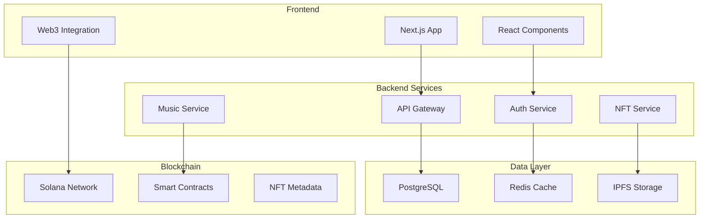

# 🏗️ Architecture Overview

## System Architecture

NormalDance использует современную микросервисную архитектуру с Web3 интеграцией.

### Core Components

#### Frontend Layer
- **Next.js 14** - React framework с App Router
- **TypeScript** - Статическая типизация
- **Tailwind CSS** - Utility-first CSS framework
- **Socket.IO Client** - Real-time коммуникация

#### Backend Layer
- **Node.js** - JavaScript runtime
- **Express.js** - Web application framework
- **Socket.IO** - Real-time bidirectional communication
- **Prisma** - Next-generation ORM

#### Database Layer
- **PostgreSQL** - Primary database
- **Redis** - Caching и session storage
- **IPFS** - Децентрализованное файловое хранилище

#### Web3 Layer
- **Solana** - Blockchain platform
- **Anchor** - Solana development framework
- **Phantom Wallet** - Web3 wallet integration
- **Metaplex** - NFT standard implementation

### Architecture Diagram

### Security Architecture

#### Multi-Layer Security
1. **Application Layer**
   - XSS Protection
   - CSRF Protection
   - Input Validation
   - Rate Limiting

2. **API Layer**
   - JWT Authentication
   - Role-based Access Control
   - API Rate Limiting
   - Request Validation

3. **Infrastructure Layer**
   - SSL/TLS Encryption
   - WAF Protection
   - Network Segmentation
   - Container Security

4. **Blockchain Layer**
   - Smart Contract Audits
   - Transaction Validation
   - Wallet Security
   - Multi-signature Support

### Performance Optimization

#### Caching Strategy
- **Browser Cache** - Static assets
- **CDN Cache** - Global content delivery
- **Redis Cache** - Application data
- **Database Cache** - Query optimization

#### Scalability Features
- **Horizontal Scaling** - Auto-scaling pods
- **Load Balancing** - Traffic distribution
- **Database Sharding** - Data partitioning
- **Microservices** - Service isolation

### Monitoring & Observability

#### Metrics Collection
- **Application Metrics** - Performance indicators
- **Infrastructure Metrics** - Resource utilization
- **Business Metrics** - User engagement
- **Security Metrics** - Threat detection

#### Logging Strategy
- **Structured Logging** - JSON format
- **Centralized Logs** - ELK Stack
- **Log Aggregation** - Multi-service correlation
- **Alert Management** - Real-time notifications